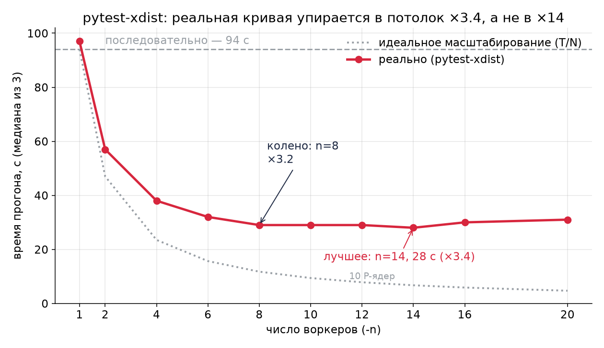

# slow-tests-benchmark

Скрипты и сырые результаты бенчмарков к серии статей на Хабре про скорость интеграционных тестов.

- **Часть 1** — [«Ваши тесты медленные не из-за базы данных. Я измерил»](https://habr.com/ru/articles/1045923/): scope фикстур, `TRUNCATE → DELETE`, argon2 — с ≈30 мин до 1.8 мин (**×16.5**).
- **Часть 2** — pytest-xdist *(ссылка после публикации)*: параллелизм **поверх** правок части 1 — ещё ×3.4, и где он упирается в потолок.

Проект: бэкенд на Litestar + SQLAlchemy (asyncpg) + PostgreSQL 18 + Redis 8, почти все тесты интеграционные — ходят в настоящую БД через реальный ASGI-сервер. Замеры локальные (MacBook Pro M4 Max, контейнеры в Docker Desktop), медиана из нескольких прогонов.

> **Это референс, а не готовый инструмент.** Проект приватный: скрипты — с путями и фрагментами его тестовой инфраструктуры (в части 2 путь к репозиторию вынесен в `PROJECT_DIR`). Запустить «как есть» не выйдет; адаптировать под свой проект — дело получаса.

## Содержание

- [Часть 1: оптимизации одного процесса](#часть-1-оптимизации-одного-процесса)
- [Часть 2: pytest-xdist](#часть-2-pytest-xdist)
- [Методика](#методика)
- [Что не публикуется](#что-не-публикуется)

---

## Часть 1: оптимизации одного процесса


Цепочка «как в статье», правки накапливаются (медиана):

| Шаг | Состояние | Время |
|---|---|---:|
| 0 | function-scope + боевой argon2 + TRUNCATE | **1795 с (≈30 мин)** |
| 1 | + session-scope фикстуры и общий loop | 221 с (−88 %) |
| 2 | + TRUNCATE → DELETE | 125 с (−43 %) |
| 3 | + быстрый argon2 в тестах | **109 с** (−13 %) |

Итог **×16.5**; львиную долю даёт одна правка — scope фикстур.

<details>
<summary>Идея и варианты отката</summary>

Каждый вариант бенчмарка — откат **одной** оптимизации к состоянию «до»:

| Вариант | Что откатывается |
|---|---|
| `baseline` | ничего — текущее состояние (все оптимизации применены) |
| `function_scope` | session-scope фикстуры и session loop scope → function (engine, redis, приложение и схема БД пересоздаются на каждый тест) |
| `truncate` | очистка БД между тестами: `DELETE` по таблицам → один `TRUNCATE ... RESTART IDENTITY CASCADE` |
| `argon2_default` | минимальные параметры argon2 в тестах → боевые |

Откат делает `apply_variant.py` точечными заменами в рабочей копии (если ожидаемый фрагмент не найден — скрипт падает, а не молча проносит мимо), восстановление — `git checkout`. Руками ничего не правится.


</details>

<details>
<summary>Скрипты части 1</summary>

- `apply_variant.py` — применяет один откат: `function_scope` | `argon2_default` | `truncate`.
- `run.sh` — основной харнес: гоняет baseline и каждый откат по отдельности, пишет время в `results/times.csv`, junit и лог на каждый прогон, сам восстанавливает рабочую копию (в т.ч. по trap на выходе).
- `run_v0.sh` — состояние «до всех оптимизаций» (function-scope + боевой argon2): снимает cProfile на подвыборке тестов и полное время прогона.
- `run_truncate_chain.sh`, `run_session_chain.sh` — цепочка «как в статье»: правки применяются последовательно, все session-точки снимаются в одном прогоне.

```bash
RUNS=3 bash run.sh                       # прогонов на вариант
VARIANTS="baseline truncate" bash run.sh # подмножество вариантов
```

</details>

<details>
<summary>Изолированные откаты и разброс TRUNCATE</summary>

Каждая оптимизация откатывается отдельно от baseline (`results/times.csv`):

| Вариант | Прогоны, с |
|---|---|
| baseline (всё применено) | 127.1 / 123.3 / 124.9 |
| откат на TRUNCATE | 152.2 / 154.9 / 179.8 — заметный разброс |
| откат на боевой argon2 | 140.4 / 143.6 / 139.1 |
| откат на function-scope | 1877.5 / 1920.6 / 1874.3 |

Разброс TRUNCATE-вариантов (152–180 с изолированно, 243–254 с в цепочке): `TRUNCATE ... CASCADE` — DDL-операция с `ACCESS EXCLUSIVE` блокировкой и обновлением каталога на каждом из 3316 вызовов, её стоимость нестабильна. `DELETE` из почти пустых таблиц в одной транзакции дешевле и предсказуемее.

</details>

---

## Часть 2: pytest-xdist

*(ссылка после публикации)*



Что даёт параллельный запуск **поверх** правок части 1 (а не вместо них). Сьют тот же, вырос до 3477 тестов. Путь к бэкенду задаётся через `PROJECT_DIR`. Кривая (дефолтная VM, дефолтный PG, DELETE-очистка, медиана из 3, `results/vm8-pgdef.tsv`):

| `-n` | время | ускорение |
|---|---:|---:|
| 0 (serial) | 94 с | ×1.00 |
| 1 | 97 с | ×0.97 (оверхед xdist) |
| 8 | 29 с | ×3.24 (колено) |
| 14 | 28 с | **×3.36 (лучшее)** |
| 20 | 31 с | ×3.03 (деградация) |

Три вывода (детали и графики — `REPORT-xdist-docker-vm.md`):

- потолок **×3.36**, а не ×14 — налог на вход возвращается как «setup × N воркеров»;
- память Docker VM (8→16 ГиБ) не даёт ничего (`vm16-pgdef.tsv` ≈ `vm8-pgdef.tsv`);
- тюнинг Postgres (`fsync=off` + tmpfs) не помогает, а на малом N вредит (`vm8-pgfast.tsv`).

<details>
<summary>Скрипты части 2</summary>

- `xdist_arm.sh` — одно «плечо» матрицы (размер Docker VM × конфиг Postgres): свежие PG+Redis перед КАЖДЫМ прогоном (`docker rm -fv` + `volume prune`), `--memory`-кэпы, реальные psql/redis-пробы, ретрай на инфра-фейл, SUSPECT-маркер при `wall − pytest > 15 с` (сон macOS). Снимает кривую `-n 0…20`.
- `run_full_experiment.sh` — драйвер трёх плеч (`vm8-pgdef`, `vm8-pgfast`, `vm16-pgdef`); переключает размер VM через `docker_vm.sh`, в конце зовёт `aggregate.py`.
- `cleanup_bench.py` / `run_cleanup_bench.sh` — микробенч очистки БД между тестами.
- `make_charts.py` — графики из `results/*.tsv` и `cleanup_bench*.csv`.
- `stop_experiment.sh` — корректно гасит дерево процессов прогона (не только драйвер).

```bash
PROJECT_DIR=/path/to/backend bash run_full_experiment.sh            # вся матрица
PROJECT_DIR=/path/to/backend bash run_full_experiment.sh vm8-pgdef  # одно плечо
PROJECT_DIR=/path/to/backend BENCH_CYCLES=300 bash run_cleanup_bench.sh
```

</details>

<details>
<summary>Микробенч очистки БД: DELETE vs TRUNCATE vs TEMPLATE</summary>

Ответ на комментарий к части 1. 53 таблицы, 300 циклов, медиана за цикл (`results/cleanup_bench_300.csv`):

| Стратегия | мс/цикл | vs DELETE |
|---|---:|---:|
| `DELETE` по таблицам | 9.2 | ×1.00 |
| `TRUNCATE ... RESTART IDENTITY CASCADE` | 12.6 | ×1.36 |
| per-test `DROP DATABASE` + `CREATE ... TEMPLATE` | 33 | ×3.6 |

`DELETE` дешевле и стабильнее; честная per-test пересборка базы платит реконнектом пула.

</details>

---

## Методика

<details>
<summary>Как мерилось</summary>

- Улучшения применяются по одному, замер после каждого.
- `-p no:randomly` — фиксированный порядок тестов (перемешивание полезно для поиска зависимостей, но для замера времени это шум).
- Несколько прогонов, в таблицах медиана.
- Один и тот же ноутбук, сравнимая фоновая нагрузка.
- Часть 2: свежие контейнеры PG+Redis перед каждым прогоном (дрейф состояния каталога коррелирует с порядком прогонов и притворяется трендом).
- CI-секунды между раннерами несравнимы — в кросс-сравнениях не используются.

</details>

## Что не публикуется

В `results/` лежат только `.tsv`/`.csv` с временами и счётчиками. Логи, junit-отчёты и операционные артефакты харнесса (`.raw`, `.debug`, `.progress`, …) содержат имена тестов и пути приватного проекта — в паблик не попадают (см. `.gitignore`).

## Лицензия

MIT
