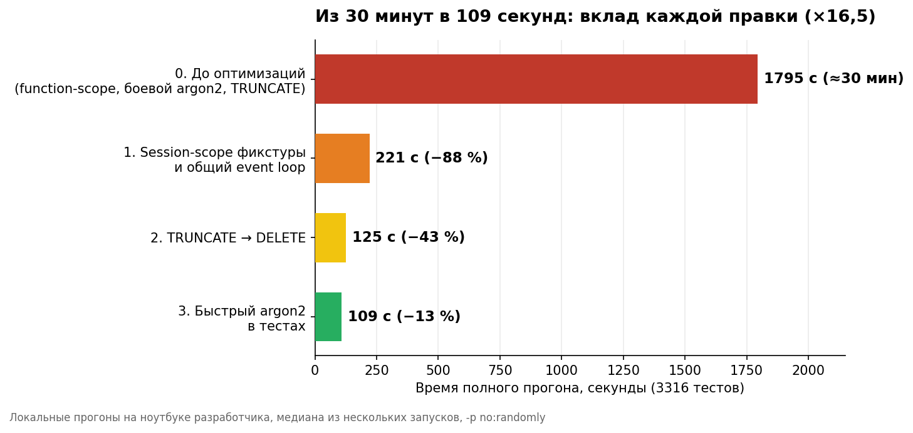
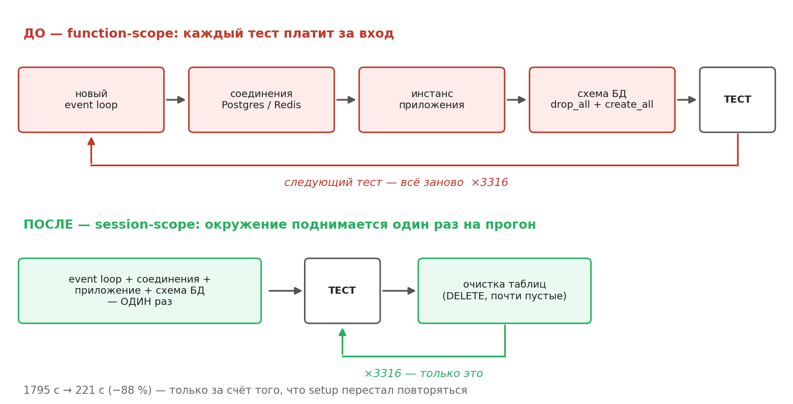

# slow-tests-benchmark

Скрипты и сырые результаты бенчмарка для статьи на Хабре —
[**«Ваши тесты медленные не из-за базы данных. Я измерил»**](https://habr.com/ru/articles/1045923/).

Проект: бэкенд на Litestar + SQLAlchemy (asyncpg) + PostgreSQL 18 + Redis 8, 3316 тестов,
почти все интеграционные — ходят в настоящую БД через реальный ASGI-сервер.
Все замеры локальные (MacBook Pro M4 Max, контейнеры в Docker Desktop),
медиана из нескольких прогонов.





## Важно: это референс, а не готовый инструмент

Сам проект приватный, поэтому скрипты здесь — как они есть, с путями и фрагментами кода
из его тестовой инфраструктуры. Запустить их у себя «как есть» не получится, но
адаптировать под свой проект — дело получаса: вся механика в том, чтобы точечно
«откатывать» одну оптимизацию за раз и замерять полный прогон.

## Идея

Каждый вариант бенчмарка — это откат **одной** оптимизации к состоянию «до»:

| Вариант | Что откатывается |
|---|---|
| `baseline` | ничего — текущее состояние (все оптимизации применены) |
| `function_scope` | session-scope фикстуры и session loop scope → function (engine, redis, приложение и схема БД пересоздаются на каждый тест) |
| `truncate` | очистка БД между тестами: `DELETE` по таблицам → один `TRUNCATE ... RESTART IDENTITY CASCADE` |
| `argon2_default` | минимальные параметры argon2 в тестах → боевые |

Откат делает `apply_variant.py` точечными заменами в рабочей копии
(если ожидаемый фрагмент не найден — скрипт падает, а не молча проносит мимо),
восстановление — `git checkout`. Руками ничего не правится.

## Скрипты

- `apply_variant.py` — применяет один откат: `function_scope` | `argon2_default` | `truncate`.
- `run.sh` — основной харнес: гоняет baseline и каждый откат по отдельности,
  пишет время в `results/times.csv`, junit и лог на каждый прогон,
  сам восстанавливает рабочую копию (в т.ч. по trap на выходе).
- `run_v0.sh` — состояние «до всех оптимизаций» (function-scope + боевой argon2):
  снимает cProfile на подвыборке тестов и полное время прогона.
- `run_truncate_chain.sh`, `run_session_chain.sh` — цепочка «как в статье»:
  правки применяются последовательно, все session-точки снимаются в одном прогоне,
  чтобы числа были внутренне сопоставимы.

Запуск (в адаптированном виде):

```bash
RUNS=3 bash run.sh                       # прогонов на вариант
VARIANTS="baseline truncate" bash run.sh # подмножество вариантов
```

## Методика

- Улучшения применяются по одному, замер после каждого.
- `-p no:randomly` — фиксированный порядок тестов (перемешивание полезно для поиска
  зависимостей, но для замера времени это шум).
- Несколько прогонов, в таблицах медиана.
- Один и тот же ноутбук, сравнимая фоновая нагрузка. Цифры из CI не используются:
  раннеры разные, их секунды между собой несравнимы.
- Откаты только скриптом, восстановление только `git checkout`.

## Результаты

Цепочка «как в статье» (правки накапливаются):

| Шаг | Состояние | Время | CSV |
|---|---|---:|---|
| 0 | function-scope + боевой argon2 + TRUNCATE | **1795 с (≈30 мин)** | `truncate_chain_times.csv` |
| 1 | + session-scope фикстуры и общий loop | 221 с (−88 %) | `session_chain_times.csv` (a1) |
| 2 | + TRUNCATE → DELETE | 125 с (−43 %) | `a4_times.csv` |
| 3 | + быстрый argon2 в тестах | **109 с** (−13 %) | `session_chain_times.csv` (a3) |

Изолированные откаты (каждая оптимизация откатывается отдельно от baseline,
`results/times.csv`):

| Вариант | Прогоны, с |
|---|---|
| baseline (всё применено) | 127.1 / 123.3 / 124.9 |
| откат на TRUNCATE | 152.2 / 154.9 / 179.8 — заметный разброс |
| откат на боевой argon2 | 140.4 / 143.6 / 139.1 |
| откат на function-scope | 1877.5 / 1920.6 / 1874.3 |

Обратите внимание на разброс TRUNCATE-вариантов (152–180 с в изолированном замере,
243–254 с в цепочке a2): `TRUNCATE ... CASCADE` — DDL-операция с `ACCESS EXCLUSIVE`
блокировкой и обновлением каталога на каждом из 3316 вызовов, её стоимость нестабильна.
`DELETE` из почти пустых таблиц в одной транзакции дешевле и предсказуемее.

В `results/` лежат только CSV с временами — логи и junit-отчёты содержат
имена тестов приватного проекта и в паблик не попали.

## Лицензия

MIT
